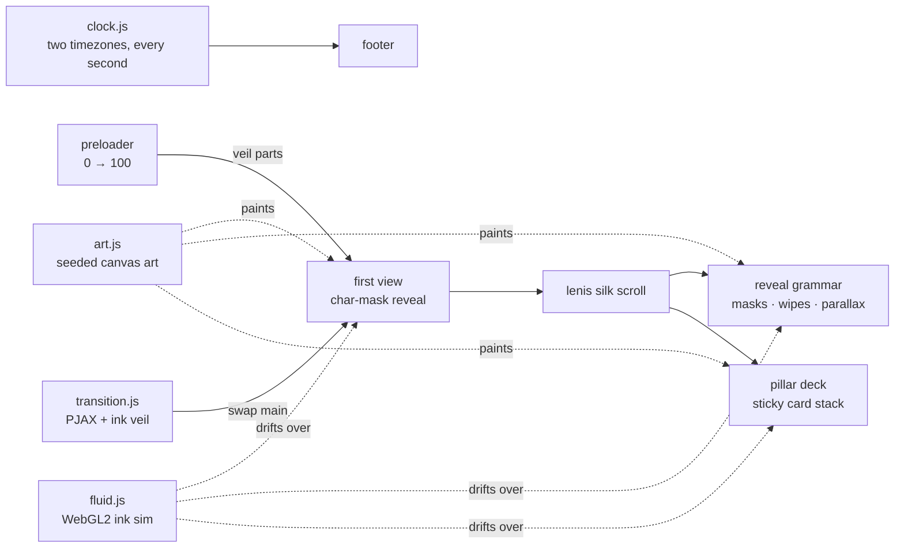

<div align="center">



<br/><br/>

**[✦ &nbsp;e n t e r&nbsp; t h e&nbsp; s i t e&nbsp; ✦](https://sujithsrinivasg8-dev.github.io/jobpilot-site/)**

<br/>

[](https://github.com/sujithsrinivasg8-dev/jobpilot-site/actions/workflows/deploy.yml)


<br/>

*An Awwwards-class, near-monochrome storytelling site in the school of high-end Japanese studio work —*
*paper grain, drifting mist, a cursor that spills ink, and a scroll like silk.*
*Built as the face of an AI job-application instrument that automates the labor of the search*
*and refuses, by design, to automate the truth.*




</div>

<br/>

## ✦ the six signature mechanics

Every mechanic of the genre is implemented from scratch — no template, no boilerplate.

| | element | what it does |
|---|---|---|
| 🌊 | **fluid** | A hand-written WebGL2 **Navier–Stokes ink simulation** follows the cursor — splat → advect → vorticity → pressure → dye. It renders *above* the content and dissipates in ~1.5s. Bursts fire on the preloader exit and every page change. |
| 🚪 | **transition** | PJAX page swaps happen under an ink veil — scrim wipes up, DOM swaps under cover, destination title mask-reveals ~1.3s door-to-door. Browser back replays the same choreography. |
| 🏔 | **parallax** | Everything carries depth: mist slowest, art mid, headings fastest. Every image is oversized inside a masked frame and counter-translates against its own frame. |
| 🧭 | **navigation** | A translucent veil menu with a right-of-center Roman-caps column, staggered masked reveals, focus trap, scroll lock, `Esc` to close, `menu ⇄ close` roll swap. |
| 🪶 | **scrolling** | Lenis lerp `0.09` — wheel input is *silk*. Text rises out of overflow masks line by line; images wipe open by clip-path; a hairline scroll cue pulses forever. |
| 🃏 | **sticky** | The three practice panels pin and stack like cards in fog — the outgoing panel sinks to `scale .94` and dims as the next slides over it. Un-pins cleanly on mobile. |

<div align="center"></div>

## ✦ the three practices

<div align="center"></div>

The brand is **jobpilot** — an instrument for the job search. *Discover* sweeps every board and quiet career page and reads each posting like a veteran recruiter. *Tailor* reshapes every line of a résumé around its true outcome — never inventing a word. *Arrive* remembers every application sent, reads the silence, and turns the traces into teaching.

> *"Lying is not discouraged here; it is structurally impossible."*

<div align="center"></div>

## ✦ zero image files

Every visual on the site — the misty forest hero, the drifting cloud bands, the ridges, water rings, garden stones, silk threads, even the film grain — is **generated procedurally at runtime** from just two colors, using a seeded PRNG so the art is identical on every visit.

```
#0A0801  ██████████  ink    — near-black with a warm undertone
#D9D7D4  ██████████  paper  — warm washi gray
```

No stock photos. No downloads. No third color, anywhere. The mist marquee tiles are built from wrapped radial gradients so the infinite drift loop is **mathematically seamless**.

## ✦ architecture



<details>
<summary><b>📂 &nbsp;project structure</b></summary>

<br/>

```
jobpilot-site/
├── index.html                  # home — hand-authored
├── philosophy.html             # ┐
├── company.html  contact.html  # │ generated from one shared shell:
├── privacy.html                # │   node scripts/gen-pages.mjs
├── pillars/{discover,tailor,arrive}.html
├── scripts/gen-pages.mjs       # ┘ edit this, not the pages
├── src/
│   ├── styles/                 # tokens · base · typography · components · sections
│   └── js/
│       ├── app.js              # boot + per-page init orchestration
│       ├── art.js              # ALL imagery, synthesized from 2 colors
│       ├── fluid.js            # stable-fluids WebGL2 ink simulation
│       ├── scroll.js           # lenis + header hide/reveal
│       ├── split.js            # hand-rolled line/char splitter
│       ├── reveal.js           # the one reveal grammar + deck + parallax
│       ├── transition.js       # PJAX under the ink veil
│       ├── menu.js             # veil menu, focus trap, scroll lock
│       ├── preloader.js        # counter → veil → hero overlap
│       ├── cursor.js           # lerped dot cursor
│       └── clock.js            # hyderabad + new york, ticking forever
└── .github/workflows/deploy.yml  # auto-deploy to GitHub Pages
```

</details>

<details>
<summary><b>⚙️ &nbsp;the fluid simulation, tuned</b></summary>

<br/>

| parameter | value | effect |
|---|---|---|
| sim resolution | 128 | velocity field density |
| dye resolution | 512 | visual crispness of the ink |
| dye dissipation | 0.955 | trail dies in ≈ 1.5 s |
| curl strength | 25 | the swirl in the smoke |
| pressure iterations | 20 | incompressibility accuracy |
| alpha ceiling | 0.22 | text always stays legible |
| idle sleep | 4.5 s | sim stops stepping when you stop |

The dye flips tone by section: **paper smoke over ink**, **ink smoke over the paper band** — watched by section, blended by `screen` / `multiply`.

</details>

<details>
<summary><b>🎨 &nbsp;design system (mined from the reference's production DOM)</b></summary>

<br/>

| role | face | size @1280w | notes |
|---|---|---|---|
| display | Playfair Display 400 | ~40px | headings whisper, never shout |
| body | Shippori Mincho 400 | ~13px / lh 2.0 | tiny, wide-leading, contemplative |
| labels | Cinzel 400 | ~11px / tracking .3em | Roman caps: menu, clocks, eyebrows |

Motion: `silk` `cubic-bezier(0.16,1,0.3,1)` for reveals · `veil` `cubic-bezier(0.65,0,0.35,1)` for wipes · durations 0.45–1.4s. Multi-line headings step-indent line by line. Inner-page titles carry a long leading hairline.

</details>

<details>
<summary><b>♿ &nbsp;accessibility & performance</b></summary>

<br/>

- `prefers-reduced-motion` is a **first-class mode**: native scroll, no fluid, no drift, 0.3s fades
- Focus trap in the menu, visible focus rings, skip-link, one `h1` per page, alt text everywhere
- Clocks wrapped `aria-hidden` with an sr-only label
- **64 KB gzipped JS** total — including GSAP, Lenis, and the fluid engine (budget was 180 KB *excluding* them)
- Transform/opacity-only animation; DPR clamped at 1.5; sim pauses when the tab hides

</details>

## ✦ run it

```bash
npm install
npm run dev        # → http://localhost:5173
```

```bash
npm run build      # → dist/  (fully static, deploy anywhere)
npm run preview    # inspect the production build locally
```

Pushing to `main` auto-builds and deploys to **[GitHub Pages](https://sujithsrinivasg8-dev.github.io/jobpilot-site/)** via Actions.

## ✦ the pages

| | route | first view |
|---|---|---|
| ⛩ | `/` | *The work remembers. Let it speak.* — the whisper in the fog |
| 🌫 | `/philosophy` | *Truth is the whole design.* |
| 🔎 | `/pillars/discover` | *every opening, found while it still breathes* |
| ✂️ | `/pillars/tailor` | *your truth, arranged for the role* |
| 🕯 | `/pillars/arrive` | *every application, remembered and measured* |
| 🏛 | `/company` | *Built for the one applying.* — with the paper inversion |
| ✉️ | `/contact` | *Say the word.* — hairline form, floating labels |

<br/>

<div align="center">


<sub>Study of the genre defined by <a href="https://izanami-official.com/">izanami-official.com</a> (baqemono.inc) — techniques rebuilt from scratch, every asset and word original.<br/>
Two colors. One quiet machine. The clocks are ticking right now.</sub>

<br/><br/>

<sub>© 2026 jobpilot · <b>ist, hyderabad ind</b> · <b>et, new york usa</b></sub>

</div>
